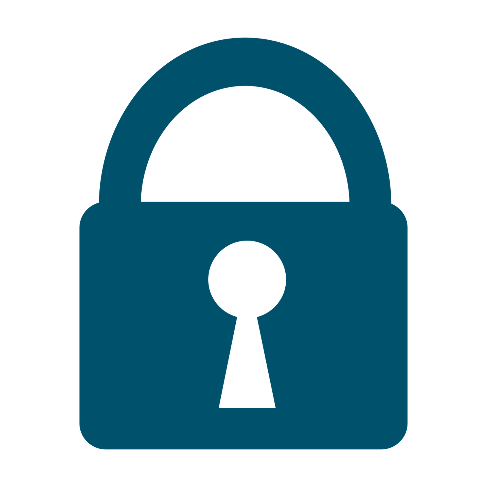

  

<h1 align="center">Safeinternet</h1>

<h3 align="center">The next generation opensource control parent</h3>

Safeinternet is a control parent decentralized for the majority of devices. It have a full public api for domains to block and AI methods to ensure the well-being of the user.
Visit our installation manuals!

## Contribute now to make internet safest

## Community

